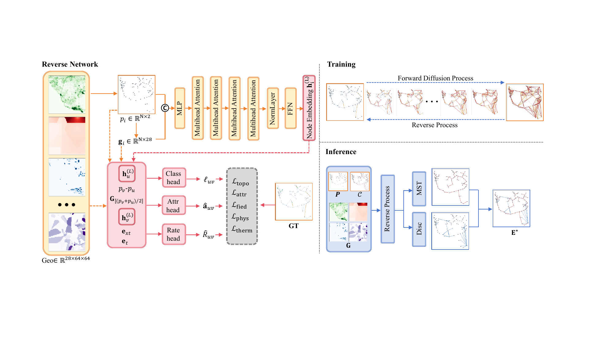
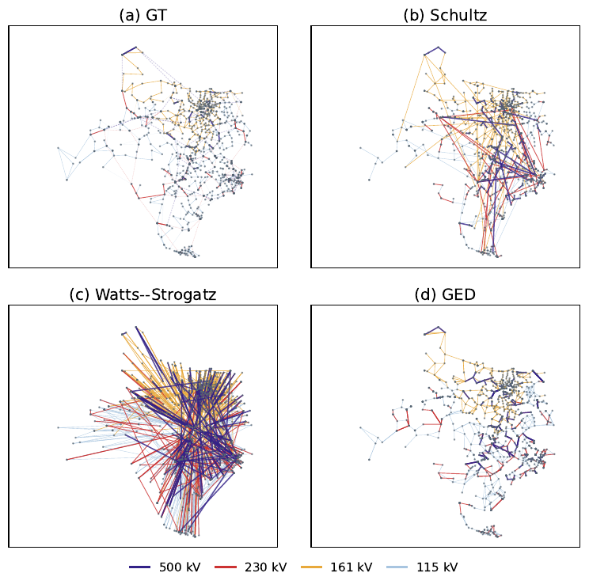

# GED: Geographic Edge Diffusion for Synthetic Transmission Grids

Official code and trained weights for the NAPS 2026 paper
**"GED: Geographic Edge Diffusion for Synthetic Transmission Grids"**
by Jingong Chen, Kwanghee Won, and Timothy M. Hansen.

GED is a categorical edge-diffusion model that builds a transmission backbone
for a given set of bus locations. Conditioned on a 28-channel geographic raster
(roads, buildings, land use, population, power plants, position encodings), it
predicts in one pass which bus pairs are connected, the voltage tier of each
branch (115/161, 230 or 500 kV), and a per-unit impedance triplet. Training
mixes 1-degree patches up to the full state of Texas, and two physics-informed
losses (a DC power-flow residual and a thermal-overload penalty) shape the
predicted graph during training. At inference a spatial minimum spanning tree
guarantees connectivity and the highest-scoring remaining candidates are added.



## Contents

```
ged/                 Python package
  model.py           denoising network (node transformer + pair heads), checkpoint loader
  diffusion.py       uniform-mixing forward kernel and reverse sampler
  candidates.py      kNN / MST candidate pairs
  inference.py       full-graph and patch inference, MST + top-K projector
  losses.py          DC power-flow and thermal-overload losses
  data.py            multi-scale datasets for the three training stages
  metrics.py         Birchfield-style graph metrics
  baselines.py       Random kNN, Geometric, Watts-Strogatz, Schultz et al.
  acpf.py            pandapower AC power flow and N-1 on ACTIVSg2000
scripts/
  00_geocode_activsg.py     (optional) geocode ACTIVSg2000 bus names
  01_prepare_data.py        build backbone, 1/4/7-degree patches, full-Texas sample
  02_train_base.py          stage 1: multi-scale training
  03_finetune_phys.py       stage 2: + DC power-flow loss
  04_finetune_thermal.py    stage 3: + rating head and thermal loss
  05_infer_full_texas.py    single-pass inference on the 1,447-bus backbone
  06_eval_birchfield.py     Table I
  07_tier_table.py          Table II
  08_ac_powerflow.py        Table III (AC power flow + N-1)
  09_ablation_mst.py        connectivity-projector ablation
  figures/                  Fig. 2 (raster channels) and Fig. 3 (topology comparison)
  reproduce_paper.sh, train_all.sh
weights/
  ged_texas.pt              final model (stage 3), 5.9 MB
  ged_texas_stage1.pt       stage-1 model used for the Table I GED row, 5.8 MB
configs/                    recorded training arguments and inference presets
data/                       ACTIVSg2000 case, geocoded CSVs, 28-channel Texas raster (see data/README.md)
results/reference/          the paper's numbers as JSON, for comparison
```

## Installation

Python 3.10 or newer. The paper's numbers were produced with Python 3.13,
PyTorch 2.11 (CUDA 12.8) on an NVIDIA RTX 5090.

```bash
git clone https://github.com/Jingong-Chen/GED.git
cd GED
conda env create -f environment.yml && conda activate ged
# or: pip install -r requirements.txt && pip install -e .
```

## Quickstart: generate the Texas backbone with the released weights

```bash
# 1. Build the processed samples from data/ (a few seconds)
python scripts/01_prepare_data.py

# 2. Single-pass inference on all 1,447 buses (under 1 s on a GPU, about 15 s on a CPU)
python scripts/05_infer_full_texas.py --preset final --out outputs/ged_full_texas.pt

# 3. Graph metrics against ACTIVSg2000 and the four baselines
python scripts/06_eval_birchfield.py --ours outputs/ged_full_texas.pt

# 4. AC power flow on the full 2,000-bus case (add --skip_n1 for a quick run)
python scripts/08_ac_powerflow.py --ours outputs/ged_full_texas.pt
```

The inference output (`outputs/ged_full_texas.pt`) is a dict with
`pred_edges` (local bus indices), `bus_id` (ACTIVSg2000 bus numbers),
`pred_classes` (1 = 115/161 kV, 2 = 230 kV, 3 = 500 kV), `pred_rxb`
(per-unit r, x, b), `edge_prob`, `is_mst`, and the full candidate set with its
scores. The model can also be used from Python:

```python
import torch
from ged import load_checkpoint, predict_full_texas

model, _ = load_checkpoint("weights/ged_texas.pt", device="cuda")
sample = torch.load("data/processed/global/global.pt", weights_only=False)
out = predict_full_texas(model, sample, knn=15, edge_density=1.7, device="cuda")
print(out["n_pred_edges"], "edges")
```

## Reproducing the paper

`bash scripts/reproduce_paper.sh` runs every step below. With the same
software stack on a CUDA GPU the outputs are bit-identical to the paper's.

| Result | Command | Weights / settings |
|---|---|---|
| Table I | `05_infer_full_texas.py --preset table1`, then `06_eval_birchfield.py` | `ged_texas_stage1.pt`, kNN 18 |
| Table II | `05_infer_full_texas.py --preset final`, then `07_tier_table.py --count_self_loops` | `ged_texas.pt`, kNN 15 |
| Table III | `08_ac_powerflow.py --ours outputs/ged_full_texas.pt` | `ged_texas.pt`, kNN 15 |
| Fig. 3 | `figures/fig_baseline_compare.py` | `ged_texas.pt`, kNN 15 |
| Ablation (Sec. IV-G) | `09_ablation_mst.py` | `ged_texas_stage1.pt`, patches |

Both presets use an edge budget of round(1.7 N) including the N - 1 MST
edges, 5 independent reverse chains of 30 steps each (seeds 0 to 4), and
average the final-step scores.

Numbers obtained from a fresh copy of this repository (RTX 5090, CUDA):

**Table I** (1,447-bus Texas backbone, lower is better)

| Method | W1(deg) | \|ΔC\| | \|ΔL\| | \|ΔD\| | \|Δλ2\| | W1(ℓ) | n_cc |
|---|---|---|---|---|---|---|---|
| Random+kNN | 2.232 | 0.716 | 2.934 | 28 | 0.001 | 0.010 | 34 |
| Geometric | 103.725 | 0.766 | 8.179 | 10 | 0.000 | 0.019 | 6 |
| Watts-Strogatz | 1.252 | 0.350 | 4.684 | 12 | 0.015 | 0.058 | 1 |
| Schultz | 0.943 | 0.187 | 3.103 | 3 | 0.003 | 0.016 | 1 |
| GED | 1.309 | 0.189 | 6.414 | 25 | 0.001 | 0.002 | 1 |

All rows match the paper. With the final weights (`--preset final`) the GED row is
1.178 / 0.205 / 5.571 / 28 / 0.001 / 0.003 / 1.

**Table II** (per-tier edge counts, final weights): identical to the paper
(GT 1169 / 630 / 186 / 142, GT ∩ C 718 / 432 / 81 / 35, GED 1008 / 569 / 45 / 40).

**Table III** (AC power flow on ACTIVSg2000, final weights)

| Variant | Conv. | V in [0.94, 1.06] | V in [0.95, 1.05] | V_min | P_loss | Lines > 100% | N-1 conv. | N-1 new V violations |
|---|---|---|---|---|---|---|---|---|
| GT | yes | 97.4% | 95.7% | 0.825 | 1.4% | 1.9% | 100.0% | 0.41 |
| Schultz | yes | 95.3% | 88.3% | 0.883 | 1.8% | 14.1% | 98.5% | 2.46 |
| GED | yes | 97.2% | 92.4% | 0.882 | 1.6% | 10.0% | 100.0% | 0.33 |



**Ablation** (16 test patches, stage-1 weights): with the MST projector every
patch is connected (mean n_cc = 1.00); without it 15 of 16 patches are
disconnected with mean n_cc = 10.12 (the paper's run reported 14 of 16 and
11.44 from an earlier no-MST sampling variant).

### Determinism

The reverse process draws categorical samples, so exact numbers depend on the
random stream. On CUDA with the pinned versions the released weights reproduce
the paper bit for bit. On a CPU the stream differs and the sampled graph
changes slightly: for the Table I preset we obtain W1(deg) 1.308,
\|ΔC\| 0.178, \|ΔL\| 4.448, \|ΔD\| 23, \|Δλ2\| 0.001, W1(ℓ) 0.002. The
path-length and diameter statistics are the most sensitive to sampling noise.

## Training from scratch

```bash
bash scripts/train_all.sh
```

Training runs in three stages (about 20 minutes on one RTX 5090). The script
defaults equal the recorded arguments in `configs/`.

| Stage | Script | Loss terms | Optimiser | Selected epoch |
|---|---|---|---|---|
| 1 | `02_train_base.py` | CE (class weights 1, 3, 5, 6) + 0.5 impedance MSE + 0.2 Fiedler (ε = 0.04) | AdamW, lr 1.5e-4, wd 1e-3, batch 2, patience 40 | 49 |
| 2 | `03_finetune_phys.py` | stage 1 + 0.1 DC power-flow loss | AdamW, lr 5e-5, 15 epochs | 14 |
| 3 | `04_finetune_thermal.py` | stage 2 + 0.3 rating MSE + 0.15 thermal loss (target loading 0.8) | AdamW, lr 5e-5, 20 epochs | 2 |

Each training step draws 384 pairs per graph (up to one third true branches,
the rest kNN(15) and MST non-edges). The training list holds the 124
training 1-degree patches, 4- and 7-degree patches (80/20 split by id,
repeated 3x and 6x) and the full-Texas graph repeated 20x. The physics losses
are evaluated on graphs with at most 120 buses. Mixed-precision is not used.
In the paper's runs the loss eventually became non-finite (stage 1 at
epoch 57, stage 3 at epoch 7); the scripts keep the best
validation checkpoint and stop once the validation loss is not finite.
GPU training is not bit-deterministic, so a retrained model will differ
slightly from the released weights.

## Implementation details

- **Network.** Node encoder: raster sampled bilinearly at each bus, linear
  projection of [position, 28 channels] to 192 dimensions, 4 transformer
  blocks (6 heads, feed-forward width 384, post-norm, no dropout). Pair trunk:
  [h_u, h_v, class embedding (32), time embedding (64), length, Δposition,
  raster at the midpoint] through a 4-layer GELU MLP (width 192), followed by
  a class head (4 logits), an impedance head (z-normalised log10 r, x, b) and,
  in stage 3, a rating head. 1.44 M parameters (1.48 M with the rating head).
- **Candidate set at inference.** kNN(k) pairs in normalised Texas
  coordinates plus the spatial MST (computed on a kNN(40) graph). Because
  many buses share a geocoded Census place, a node's kNN list can contain
  itself, which yields a few degenerate (i, i) pairs. They occupy slots in the
  edge budget (96 of 2,460 for the final preset) and are dropped by the
  metrics and the AC study. `07_tier_table.py` excludes them by default;
  `--count_self_loops` reproduces the printed Table II.
- **Reference candidate set for Table II and Fig. 3.** GT ∩ C uses kNN(12) in
  longitude/latitude degrees plus the exact Euclidean MST; it covers 59.5% of
  same-tier GT branches (24.6% at 500 kV, 43.5% at 230 kV).
- **Baselines in Table I.** Random kNN (k = 3), geometric radius graph
  (ε = 0.06 in normalised coordinates), Watts-Strogatz (k = 4, p = 0.1,
  seed 42), Schultz et al. (p = 0.2, q = 0.075, seed 42). In Table III the
  Schultz backbone is built on longitude/latitude with seed 0.
- **AC protocol.** Same-tier backbone branches of ACTIVSg2000 are replaced by
  the evaluated backbone with tier-median per-unit impedance scaled by
  haversine length over a tier-median length (35, 50, 80, 150 km for 115, 161,
  230, 500 kV); cross-tier transformers and the sub-115 kV network are kept; a
  per-tier MST closes disconnected tiers; Newton-Raphson runs once. N-1 trips
  200 randomly sampled backbone lines (seed 0).

## Data

All inputs ship in `data/` (about 3 MB); see [data/README.md](data/README.md)
for sources, licenses and the channel list. ACTIVSg2000 is a fully synthetic
case from Texas A&M University released under CC BY 3.0. The raster is derived
from OpenStreetMap (ODbL), U.S. Census and U.S. EIA data.

## Citation

```bibtex
@inproceedings{chen2026ged,
  title     = {{GED}: Geographic Edge Diffusion for Synthetic Transmission Grids},
  author    = {Chen, Jingong and Won, Kwanghee and Hansen, Timothy M.},
  booktitle = {Proceedings of the North American Power Symposium (NAPS)},
  year      = {2026},
  note      = {to appear}
}
```

Please also cite ACTIVSg2000 (Birchfield et al., IEEE Trans. Power Systems,
2017) when using the data.

## License

Code and weights: [CC BY-NC 4.0](https://creativecommons.org/licenses/by-nc/4.0/) (see [LICENSE](LICENSE)).
You may use, share and adapt them for noncommercial purposes with attribution; commercial use is not permitted.
Data files keep their upstream licenses (see [data/README.md](data/README.md)).

## Acknowledgments

This work was supported by the U.S. National Science Foundation under Grant
No. 2316400. The authors thank the South Dakota State University High
Performance Computing team for computing resources.
